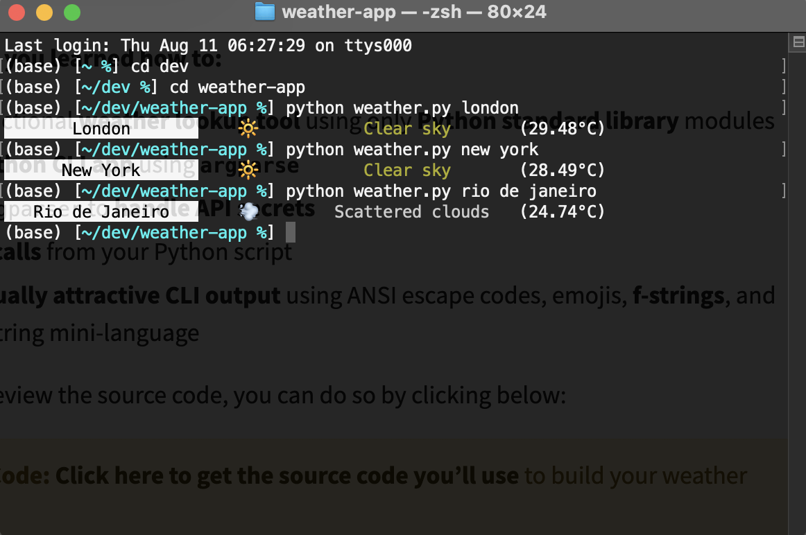

# Weather App - CLI



Weather CLI app written in Python to get current weather from a city.

Displays weather data from: https://home.openweathermap.org/

Take it for a spin:

After you clone the repo, add a secrets.ini file to your root folder and include the following:

```
; secrets.ini

[openweather]
api_key=<YOUR_OPEN_WEATHER_MAP_API_KEY>
```

To start the app in Terminal use:

`python weather.py honolulu --imperial` for Farenheit
`python weather.py london` for Celcius
